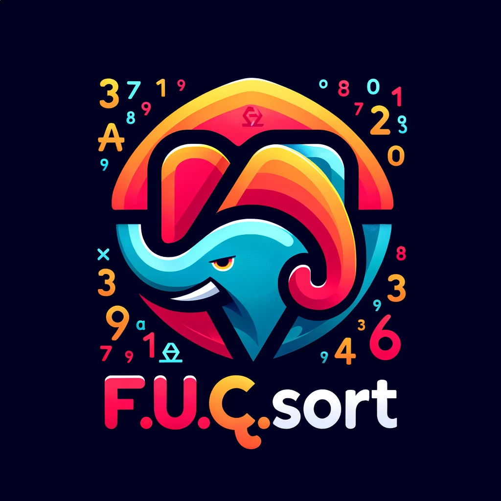

 

# FucqSort - A Collection of Sorting Algorithms

## Introduction

FucqSort (Fast Unconventional Clever Quick Sort) is an educational repository that presents a variety of sorting algorithms, ranging from well-established methods to experimental approaches. This collection is designed for educational purposes, offering insights into different sorting techniques and their implementations in PHP.

## What Does FucqSort Stand For?

"FucqSort" stands for:
- **F**ast: Emphasizing its rapid sorting capability, especially with large datasets.
- **U**nconventional: Highlighting its unique approach and methodology in sorting.
- **C**lever: Reflecting the ingenuity and effectiveness of its algorithm.
- **Q**uick: Focusing on its ability to efficiently handle big data sorting tasks.
- **Sort**: Indicating its primary function as a sorting algorithm.

## Algorithms Included

- **FucqSort**: Our flagship experimental algorithm, known for its efficiency with large integer datasets.
- **Bubble Sort**: A basic sorting algorithm that repeatedly steps through the list to compare and swap adjacent elements.
- **Selection Sort**: Divides the list into sorted and unsorted sublists, moving the smallest or largest element from unsorted to sorted.
- **Insertion Sort**: Builds the final sorted array one item at a time, efficient for smaller lists.
- **Quick Sort**: A divide-and-conquer algorithm that selects a pivot element and partitions the array into sub-arrays.
- **Pied Piper Sort**: Processes an array from the middle out, comparing and swapping elements.
- **Custom Middle-Out 3D Matrix Sort**: Sorts a 3D matrix by flattening, sorting, and reassembling it from the center outward.
- **LessThanGreaterThan Sort**: Assigns keys based on whether elements are higher or lower than previous ones, then sorts.
- **Block Sort**: Breaks the array into blocks, sorting them using a merge and insertion sort hybrid approach.

## Usage

Each algorithm is implemented as a PHP class with a static method to perform the sort. To use an algorithm, simply include the class file and call the static sort method with your array.

Example:
## Example Usages and Descriptions

### FucqSort:
```php
$sortedArray = FucqSort::sort($yourArray);
```
Ideal for large integer datasets; offers a quick and unconventional sorting approach.

### Bubble Sort:

```php
$sortedArray = FucqSort::bubbleSort($yourArray);
```
Best for educational purposes and small arrays.

### Selection Sort:

```php
$sortedArray = FucqSort::selectionSort($yourArray);
```
Suitable for small to medium-sized lists; simple but less efficient.

### Insertion Sort:

```php
$sortedArray = FucqSort::insertionSort($yourArray);
```
Perfect for small or nearly sorted datasets.

### Quick Sort:

```php
$sortedArray = FucqSort::quickSort($yourArray);
```
Highly efficient for large datasets.

### Pied Piper Sort:

```php
$sortedArray = FucqSort::piedPiperSort($yourArray);
```
A conceptual method for understanding array processing.

### Custom Middle-Out 3D Matrix Sort:

```php
$sortedMatrix = FucqSort::custom3DMatrixSort($your3DMatrix);
```
Demonstrates sorting of 3D matrices.

### LessThanGreaterThan Sort:

```php
$sortedArray = FucqSort::customIncrementalKeySort($yourArray);
```
Experimental; focuses on relative element differences.

### Block Sort:

```php
FucqSort::blockSort($yourArray);
```
Combines merge and insertion sort principles, good for medium to large datasets.
